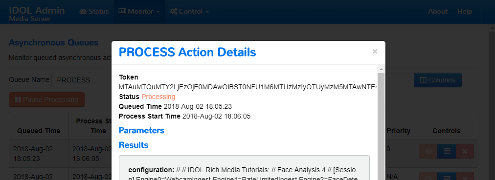
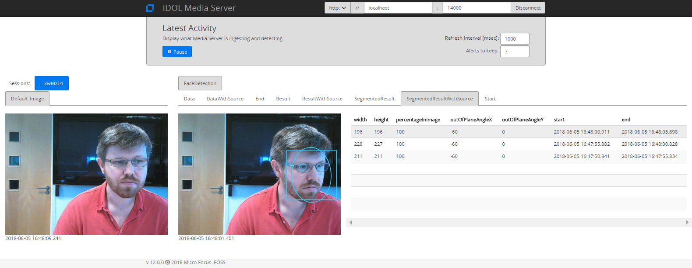

# PART I - Getting started with face detection

We will:

1. connect to and ingest video from a webcam
1. use the *FaceDetect* analysis engine to track people seem by the webcam
1. display results in Media Server's *Activity* user interface

<!-- TOC -->

- [Setup](#setup)
- [Enabling analytics](#enabling-analytics)
  - [Modules](#modules)
  - [Channels](#channels)
- [Processing video](#processing-video)
- [Process configuration](#process-configuration)
  - [Ingest](#ingest)
  - [Analysis](#analysis)
  - [Output](#output)
- [Your first analysis: run Face Detection](#your-first-analysis-run-face-detection)
  - [Monitoring and debugging](#monitoring-and-debugging)
    - [Process queue](#process-queue)
    - [Log files](#log-files)
    - [Display ongoing analytics in *Activity* user interface](#display-ongoing-analytics-in-activity-user-interface)
    - [Track types](#track-types)
    - [Active track variants](#active-track-variants)
  - [View output](#view-output)
  - [Stop analysis](#stop-analysis)
- [PART II - More face analytics](#part-ii---more-face-analytics)

<!-- /TOC -->

## Setup

Let's assume you have already followed [this short guide](../setup/INSTALL.md) to install the required software.

## Enabling analytics

A single Media Server instance is capable of running many analytics.  Each must be enabled in the `mediaserver.cfg` and also permitted by your license key in order to be used.

### Modules

The `Modules` section is where we list the engines that will be available to Media Server on startup.  By default this list contains all modules:

```ini
[Modules]
Enable=barcode,demographics,facedetect,facestate,facerecognize,imagecomparison,numberplate,object,objectclass,objectdetection,ocr,vehiclemodel
```

For this introductory tutorial, we will depend on the following items:

- demographics
- facedetect
- facestate
- facerecognize

### Channels

The `Channels` section is where we instruct Media Server to request license seats from License Server.  Media Server has four license *flavours*:

1. Audio
1. Surveillance
1. Visual
1. Video Management

To enable the face analytics required for this tutorial, you need to enable at least one channel of either *Surveillance* or *Visual*, *e.g.*

```ini
[Channels]
...
VisualChannels=1
```

*N.B.* For any changes you make in `mediaserver.cfg` to take effect you must restart Media Server.

For full details on the analytics enabled by (as well as the limitations imposed by) each license type, please read the [reference guide](https://www.microfocus.com/documentation/idol/IDOL_12_1/MediaServer/Help/index.html#Configuration/Channels/Channels.htm).

## Processing video

Media Server is directed to process a video, audio or image source with a *process* configuration file that defines how Media Server should ingest, analyze, output and otherwise manipulate the content and any resulting information.  A number of example files is included in Media Server's `configurations/examples` directory.

*N.B.* Media Server can run multiple processes concurrently if licensed to do so.  The number of concurrent processes is limited in `mediaserver.cfg` by the parameter:

```ini
[Process]
MaximumThreads=2
```

## Process configuration

The format of a process configuration file is typically laid out in the following sections:

- Ingest
- Analysis
- Event Processing
- Transform
- Encoding
- Output

We will introduce and use each of these sections in this tutorial.  Full details of the available configuration options can be found in the [reference guide](https://www.microfocus.com/documentation/idol/IDOL_12_1/MediaServer/Help/index.html#Configuration/SessionConfiguration.htm).

### Ingest

We will configure the Ingest engine to accept video from your webcam.  Use [this guide](../setup/WEBCAM.md) to set up connection to your webcam.

The ingest configuration section to connect we will use now will look as follows:

```ini
[Session]
Engine0 = WebcamIngest

[WebcamIngest]
Type = Video
# On Windows
Format = dshow
# On Ubuntu
# Format = v4l2
```

*N.B.* More options are available for the `Video`-type ingest engine.  Please read the [reference guide](https://www.microfocus.com/documentation/idol/IDOL_12_1/MediaServer/Help/index.html#Configuration/Ingest/Libav/_Libav.htm).

### Analysis

To detect faces, we need to include the following:

```ini
[Session]
Engine1 = FaceDetection

[FaceDetection]
Type = FaceDetect
```

*N.B.* More options are available for the `FaceDetect`-type analysis engine, such as the minimum expected face size.  Please read the [reference guide](https://www.microfocus.com/documentation/idol/IDOL_12_1/MediaServer/Help/index.html#Configuration/Analysis/Face/_Face.htm).

### Output

To output results, we can to include the following:

```ini
[Session]
Engine2 = OutputTrackedFaces

[OutputTrackedFaces]
Type = xml
Mode = singleRecord
Input = FaceDetection.Result
XMLOutputPath=./output/faces1/%segment.startTime.timestamp%.xml
```

*N.B.* More output options are available, such as HTTP POST and database insert.  Please read the [reference guide](https://www.microfocus.com/documentation/idol/IDOL_12_1/MediaServer/Help/index.html#Configuration/OutputEngines/_Output.htm), for details.

## Your first analysis: run Face Detection

A process action is started with an HTTP request of the form:

```url
http://127.0.0.1:14000/action=process&source=<MY_SOURCE>&configName=<MY_PROCESS_CONFIG_NAME>
```

, where `source` specifies the address of the media to be processed and `configName` points to the session configuration where we define how the media should be processed.

For testing, we will launch these actions through the admin interface [`test-action`](http://127.0.0.1:14000/a=admin#page/console/test-action) page, with which you can easily edit particular parameter values, such as `source`, to match your setup.

1. Copy the `faceAnalysis1.cfg` process configuration file into a new directory under Media Server: `configurations/tutorials` directory.
1. Paste the following parameters into [`test-action`](http://127.0.0.1:14000/a=admin#page/console/test-action):

  ```url
  action=process&source=video%3DHP%20HD%20Camera&configName=tutorials/faceAnalysis1
  ```

1. Update the webcam name from `HP HD Camera` to match yours:

  

1. Click `Test Action` to start processing. If your webcam has an indicator light, it should come on now.

*N.B.* More options are available for the *Process* action.  Please read the [reference guide](https://www.microfocus.com/documentation/idol/IDOL_12_1/MediaServer/Help/index.html#Actions/VideoAnalysis/_MediaAnalysis.htm).

### Monitoring and debugging

Once you've launched the process request, there are a number of ways you can monitor Media Server:

#### Process queue

After you clicked `Test Action` above, you were presented with a token hyperlink that uniquely identifies the process session:


Click the token string link (open it in a new tab) to view your task's status in the process queue:



#### Log files

Media Server writes out a number of different log files to its `logs` directory.  When testing process actions the main log to look at is `engine.log`.  You can see any configuration errors here.  For example, if I entered the wrong webcam name above I might see the lines:

```ini
05/06/2018 17:31:45 [167] 70-Error: [MTAuMTQuMTU3LjIxOjE0MDAwOlBST0NFU1M6MTUyODIxNjMwMzg5OTAxMDU4OTA4ODM5] Failed: Failed to set up 1 engine:
05/06/2018 17:31:45 [167] 70-Error: [MTAuMTQuMTU3LjIxOjE0MDAwOlBST0NFU1M6MTUyODIxNjMwMzg5OTAxMDU4OTA4ODM5] 'WebcamIngest': File I/O: unable to open source
```

#### Display ongoing analytics in *Activity* user interface

Media Server's *Activity* user interface is a single-page web application (tested in Google Chrome) intended for the display of running analytics on your Media Server.  This app can be useful for both testing and demonstrating Media Server.

*N.B.* The app makes use of two Media Server calls to get the list of channels and then to get the latest record for the channel you select:

- [`action=getStatus&showTracksStatistics`](https://www.microfocus.com/documentation/idol/IDOL_12_1/MediaServer/Help/index.html#Actions/Status/GetStatus_ShowTracksStatistics.htm)
- [`action=getLatestRecord`](https://www.microfocus.com/documentation/idol/IDOL_12_1/MediaServer/Help/index.html#Actions/VideoAnalysis/GetLatestRecord.htm)

With the analysis running, point your browser to [`activity`](http://127.0.0.1:14000/a=activity) to open the web application.

- Navigate the tabs to view the alerts coming through.
- You can modify the refresh interval (milliseconds) and the number of alerts to keep per tab.



*N.B.1* This app is not guaranteed to show every alert but only the latest one at the time of polling Media Server.

*N.B.2* `Default_Image` is the automatically assigned name of the track containing the incoming video.

#### Track types

Notice *FaceDetect* analysis engine produces five output tracks:

Name | Description
--- | ---
Data | Contains one record, describing the analysis results, per detected face, per video frame.
DataWithSource | The same as the Data track, but each record also includes the source frame. This information can be passed to other analysis engines to run tasks such as face recognition or demographic analysis.
Result | Contains one record, describing the analysis results, for each detected face. When the same face appears in many consecutive frames, Media Server produces a single result.
ResultWithSource | The same as the Result track, but each record also includes the *best* source frame.
SegmentedResult | (Available only when processing video). Contains one or more records, describing the analysis results, for each detected face. The maximum duration of records in this track is limited by the parameter `SegmentDuration`, so multiple records are created with the same ID when a face remains in the scene for longer than this duration.
SegmentedResultWithSource | (Available only when processing video). The same as the SegmentedResult track, but each record also includes the best source frame.
Start | The same as the Data track, except it contains only the first record of each event.
End | The same as the Data track, except it contains only the last record of each event.


Let's observe how these tracks are created for ourselves:

1. Select the `DataWithSource` tab and observe new records being emitted almost every time the *Activity* page requests one.
1. Select the `ResultWithSource` tab.  No new events are appearing.
1. Now, cover the webcam with your hand and *viola!* a new event will appear as Media Server has stopped tracking your face.

#### Active track variants

You may have noticed the `Keep` engine in the process config file we just used.  This is a *Combine*-type Event Processing engine and has been configured to take all the Face Detection track variants as its input.  Setting a track variant as input to another engine ensures that Media Server populates that track variants, *i.e.* so we can see what it contains in the *Activity* page.  If a given track variant is not connected to any engine, Media Server will not create it.  You can experiment with this by commenting out the `[Keep]` section and re-running this analysis.  Only the FaceDetection Result track wil be displayed.  This track variant is created because it is configured as the input to `OutputTrackedFaces`.

### View output

Open the folder `output/faces1` to see the `.xml` files produced with each face result. The contain all metadata associated with the detection event, *e.g.* tracking start and end times, as well the the face coordinates at the peak time of the track.

```xml
<record>
  <timestamp>
    <startTime iso8601="2018-06-05T12:58:54.482985Z">1528203534482985</startTime>
    <duration iso8601="PT00H02M03.789000S">123789000</duration>
    <peakTime iso8601="2018-06-05T12:59:44.489985Z">1528203584489985</peakTime>
    <endTime iso8601="2018-06-05T13:00:58.271985Z">1528203658271985</endTime>
  </timestamp>
  <trackname>FaceDetection.Result</trackname>
  <FaceResult>
    <id>b8082afd-58f6-400f-94b7-bcf843b93e8f</id>
    <face>
      <region>
        <left>393</left>
        <top>121</top>
        <width>230</width>
        <height>230</height>
      </region>
      <outOfPlaneAngleX>0</outOfPlaneAngleX>
      <outOfPlaneAngleY>0</outOfPlaneAngleY>
      <percentageInImage>100</percentageInImage>
      <ellipse>
        <center>
          <x>507.696014</x>
          <y>235.132584</y>
        </center>
        <a>83.4014969</a>
        <b>116.7621</b>
        <angle>-3.49884057</angle>
      </ellipse>
      <lefteye>
        <center>
          <x>539.03</x>
          <y>201</y>
        </center>
        <radius>11</radius>
      </lefteye>
      <righteye>
        <center>
          <x>472.44</x>
          <y>205.08</y>
        </center>
        <radius>14</radius>
      </righteye>
    </face>
  </FaceResult>
</record>
```

### Stop analysis

To stop processing, paste the following into [`test-action`](http://127.0.0.1:14000/a=admin#page/console/test-action) then click `Test Action` to see the response:

```url
action=queueInfo&queueAction=stop&queueName=process
```

*N.B.* If your Media Server is running multiple processes, you can supply a [token parameter](https://www.microfocus.com/documentation/idol/IDOL_12_1/MediaServer/Help/index.html#Actions/General/_ACI_QueueInfo_Token.htm) to the above action.

Or simply click [`stop`](http://127.0.0.1:14000/a=queueInfo&queueAction=stop&queueName=process).

If your webcam has an indicator light, it should now switch off.

## PART II - More face analytics

Start [here](PART_II.md).

_*END*_
