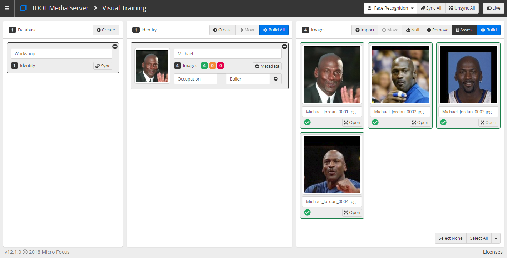

# PART III - Face recognition

We will:

1. train faces and use the `FaceRecognize` analysis engine to match them
1. optimise analysis configuration for good performance

<!-- TOC -->

- [Face training](#face-training)
  - [Train your own face](#train-your-own-face)
  - [Assessing faces for training](#assessing-faces-for-training)
- [Face matching](#face-matching)
  - [Auto enrollment of faces](#auto-enrollment-of-faces)
- [Considerations for a real face recognition system](#considerations-for-a-real-face-recognition-system)
  - [Quantifying performance](#quantifying-performance)
  - [Key variables to optimise](#key-variables-to-optimise)
  - [Hardware requirements](#hardware-requirements)
- [PART IV - People counting: an example of app integration](#part-iv---people-counting-an-example-of-app-integration)

<!-- /TOC -->

## Face training

Media Server can be trained to recognize faces, as well as objects, classes of object, vehicles and more.  We will now train our faces into the system and run the `FaceRecognize` analysis engine to identify ourselves from the webcam stream.

Media Server training can be performed through its web API, detailed in the  [reference guide](https://www.microfocus.com/documentation/idol/IDOL_12_1/MediaServer/Help/index.html#Actions/Training/_TrainingActions.htm).  For smaller or one-off projects you may find it easier to use the [`gui`](http://127.0.0.1:14000/a=gui) web interface.



*N.B.* These trained faces of Michael Jordan were sourced from [Labeled Faces in the Wild: A Database for Studying Face Recognition in Unconstrained Environment](http://vis-www.cs.umass.edu/lfw/lfw.pdf).

### Train your own face

Open the [`gui`](http://127.0.0.1:14000/a=gui) (tested in Google Chrome) then follow these steps to train your identity:

1. at the top right, note that *Face Recognition* is the selected analytic by default
1. in the left column, click `Add` to add a new *database* (a collection of identities)
    - rename the database to `Workshop`
1. in the center column, click `Add` to add a new *identity*
    - give your identity a name
    - (optionally) add key-value metadata
1. in the right column, click `Add` to import images
    - Navigate to `output/faces3` to select some of cropped images we just created
1. click `Build` to train your identity

The training status for each image is indicated at its bottom left: green for trained, yellow untrained and red for failed.

*N.B.* If you are running a laptop with an AMD processor, Media Server may become unresponsive when you attempt to train a face.  In this event, to configure Media Server correctly for your system, follow [these steps](../setup/PATCH_AMD.md).

### Assessing faces for training

When selecting images of faces for training, we should follow the guidance given in the [admin guide](https://www.microfocus.com/documentation/idol/IDOL_12_1/MediaServer/Guides/html/English/index.html#Training/Face_ImageGuide.htm).

You can also instruct Media Server to assess training images without actually training them to warn you of any potential errors.  In the `gui`, follow these steps:

1. select one or many imported images
1. on the menu bar above them, click `Assess`
1. error and warning icons appear there there are any to report
1. hover over the error/warning triangles to see the messages

In this screenshot for example:


The following errors and warnings are returned:

<i></i> | __*left*__ | __*center*__ | __*right*__
--- | --- | --- | ---
__*top*__ | *None* | *Error*: Image data nulled | *Error*: More than one face detected
__*bottom*__ | *Error*: No face detected | *Warning*: Side-view face | *None*

*NB1* The warning triangles are colored yellow in the `gui` to indicate that training would succeed but that matching performance will be sub optimal.  Red error triangles indicate that the image would not be trained successfully.

*NB2* The detection of more than one face in the image does not guarantee an error.  If one face is significantly bigger than the others then it can be successfully trained, *e.g.* in the image below, where the trained face is overlayed in blue and the background faces in purple.


## Face matching

Once we have trained some faces, we are ready to run the `FaceRecognize` analysis engine.  To do this, we can define the following process configuration:

```ini
[Session]
Engine0 = VideoIngest
Engine1 = FaceDetection
Engine2 = FaceRecognition

...

[FaceRecognition]
Type = FaceRecognize
Input = FaceDetection.ResultWithSource
```

*N.B.* More options are available for the `FaceRecognize` analysis engine, including restriction to a particular matching database, setting the matching threshold and allowing multiple matches to be returned.  Please read the [reference guide](https://www.microfocus.com/documentation/idol/IDOL_12_1/MediaServer/Help/index.html#Configuration/Analysis/FaceRecognize/_FaceRecognize.htm) for details.

Copy the `faceAnalysis6.cfg` process configuration file into your Media Server's `configurations/tutorials` directory then paste the following parameters into [`test-action`](http://127.0.0.1:14000/a=admin#page/console/test-action) (again remembering to update the webcam name from `HP HD Camera` to match yours):

```url
action=process&source=video%3DHP%20HD%20Camera&configName=tutorials/faceAnalysis6
```

Click `Test Action` to start processing.

Review the results with [`activity`](http://127.0.0.1:14000/a=activity).  As before, we can use the `FaceDetection.SegmentedResultWithSource` track to tap into the on-going track and give alerts at regular intervals. Interrupt the tracking by covering your webcam to trigger new entries in the `FaceRecognition.ResultWithSource` track.

Stop processing with [`stop`](http://127.0.0.1:14000/a=queueInfo&queueAction=stop&queueName=process).

### Auto enrollment of faces

Media Server can be configured to automatically enroll face images to a chosen database and identity, for example if they are not matched to an identity already trained in that database.

To enable auto enrollment, we must ensure that Media Server has at least one channel of type `Visual`, *e.g.* verify that your `mediaserver.cfg` includes the following.

```ini
[Channels]
...
VisualChannels=1
```

We can now configure the following process:

- with a transform engine to crop the faces ready for enrollment:

    ```ini
    [FaceImageCrop]
    Type = Crop
    Input = FaceRecognition.ResultWithSource
    Border = 15
    BorderUnit = Percent
    ```

- with event processing to filter known and unknown faces using already included Lua functions:

    ```ini
    [KnownFace]
    Type = Filter
    Input = FaceImageCrop.Output
    LuaScript = lua/knownIdentity.lua

    [UnknownFace]
    Type = Filter
    Input = FaceImageCrop.Output
    LuaScript = lua/unknownIdentity.lua
    ```

- with the enroll engine actions themselves:

    ```ini
    [AutoEnrollKnown]
    Type = Enroll
    Module = Face
    Input = KnownFace.Output
    Database = %record.FaceRecognitionResultAndImage.identity.database%
    Identifier = %record.FaceRecognitionResultAndImage.identity.identifier%

    [AutoEnrollUnknown]
    Type = Enroll
    Module = Face
    Input = UnknownFace.Output
    Database = Workshop
    ```

Copy the `faceAnalysis7.cfg` process configuration file into your Media Server's `configurations/tutorials` directory then paste the following parameters into [`test-action`](http://127.0.0.1:14000/a=admin#page/console/test-action) (again remembering to update the webcam name from `HP HD Camera` to match yours):

```url
action=process&source=video%3DHP%20HD%20Camera&configName=tutorials/faceAnalysis7
```

Click `Test Action` to start processing.

Review the results with [`activity`](http://127.0.0.1:14000/a=activity).  Remember we can interrupt the tracking by covering your webcam to trigger new entries in the `Result` track.

To add an unknown face, ask your neighbor to look in your webcam, or hold your phone showing a photo of someone else up in front of the webcam.

View (and edit) the enrolled faces with the [`gui`](http://127.0.0.1:14000/a=graphicaluserinterface) web app.

Stop processing with [`stop`](http://127.0.0.1:14000/a=queueInfo&queueAction=stop&queueName=process).

## Considerations for a real face recognition system

### Quantifying performance

When configuring a face recognition system, it is important to quantify the performance in order to optimise your configuration options and, often more importantly, your real-world setup like camera position and frame rate.

As with any performance checking, this is a process involving human validation.  We need to process a sample of footage, count and write down the following quantities:

- (TP) true positive *or* hit
- (TN) true negative *or* correct rejection
- (FP) false positive *or* false alarm
- (FN) false negative *or* miss

With these quantities you can calculate a single accuracy metric wit the following [formula](https://en.wikipedia.org/wiki/Precision_and_recall):


### Key variables to optimise

When recording statistics to calculate our performance metric, we should also take note of the main characteristics of the matched faces:

- Face width in pixels
- Percentage of face in scene
- Face recognition confidence
- Face match rank

*N.B.* to get more data, you can allow for multiple matches using the `MaxRecognitionResults` parameter and setting a relatively low `RecognitionThreshold`.

With these values to hand, you can straightforwardly check how, *e.g.* changing the `RecognitionThreshold` or `MinSize` parameters would have effected your accuracy metric, without the need to reprocess your video.

*N.B.* You will find that performance will drop off sharply as faces get smaller.  We recommend a minimum face size of 150 pixels but you can work with smaller faces if you are willing to increase your recognition threshold.

Tuning other variables may require additional tests, *e.g.* using:

- additional video samples with a different camera angle and/or resolution.
- reprocessing the same sample at different frame rate, *i.e.* by varying the `SampleInterval` parameter of the `FaceDetect` engine.

*N.B.* Video takes up a lot of bandwidth, so we want to find the minimal data rate required for good performance.  The best way to reduce data traffic is by dropping frame rate.  Don't be aggressive with cutting the encoding quality since we want to keep relatively precise images for accurate face recognition.

Further optimizations:

- After observing a scene for some time you may know that faces typically only appear in a particular region of the screen.  If this is the case, you can reducing face detection processing by defining a `Region`.
- Sometimes background features may be misidentified as faces.  This potential source of false alerts may be reduced by enabling the `ColorAnalysis` option in `FaceDetect`.
- If you cannot reduce your video resolution or frame rate any more and are struggling to process video at the required rate, e.g. in real-time from a CCTV camera, you can use for processing resources to run both `FaceDetect` and `FaceRecognize` in parallel.  The detection step is the most likely bottleneck unless you have a very large face database to match against.

### Hardware requirements

Processing requirements vary greatly, depending strongly on video resolution, fame rate, face size and number of faces.  The basic rule of thumb is that Media Server will require one CPU core to run each of the following tasks in near real-time:

- video ingest
- face detection
- face recognition
- video encoding (*if required*)

If adding large numbers of faces to the database you will need to start considering storage and memory requirements.  Each face descriptor must be loaded into memory for matching, so you need to have enough memory on each of the machines where Media Server is running.  Each descriptor is roughly 5KB in size, so each GB of RAM can hold approximately 200,000 faces.

In this tutorial, we have used a local `mediaserver.db` to store our trained faces.  In production, you should configure an external database such as PostgrSQL, as described in the [admin guide](https://www.microfocus.com/documentation/idol/IDOL_12_1/MediaServer/Guides/html/English/index.html#Getting_Started/Configure/_TRN_Set_up_databases.htm).

## PART IV - People counting: an example of app integration

Start [here](PART_IV.md).

_*END*_
