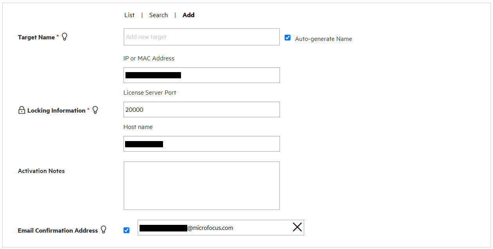

# Create your own IDOL rich media setup

This is a setup guide for a basic installation of IDOL rich media and associated components.

<!-- TOC depthFrom:2 -->

- [Useful third-party tools](#useful-third-party-tools)
- [IDOL components](#idol-components)
  - [Obtain an IDOL license](#obtain-an-idol-license)
  - [Install IDOL software](#install-idol-software)
  - [Obtaining tutorial materials](#obtaining-tutorial-materials)
    - [Following this guide offline](#following-this-guide-offline)
    - [Validate install](#validate-install)
  - [Further reading](#further-reading)

<!-- /TOC -->

## Useful third-party tools

A text editor, *e.g.*:

- [VS Code](https://code.visualstudio.com/download), or
- [Notepad++](https://notepad-plus-plus.org/download)

A log follower, *e.g.*:

- `tail -F` from the command line, or
- [Baretail](https://www.baremetalsoft.com/baretail/) - select the *Free Version*

## IDOL components

IDOL components are licensed via the IDOL License Server application, which requires a license key.

### Obtain an IDOL license

You can obtain software and licenses from the [eSoftware/Partner portal](https://entitlement.microfocus.com/evalportal/index.do).

1. Under *Product Center*, select *IDOL*, then *IDOL Ultimate*
2. Complete the web form with your details to gain access
3. Under the *Get Licensing* tab, scroll to the bottom and click __Get License__:

    

4. Click through the pop-ups then, scroll to the bottom and click __Activate__ next to your *IDOL # day Personal license*

   

5. Select this license, then choose your preferred version (the latest is 12.8):

   

6. Fill in the license details, including the MAC address and hostname of the machine where you will install IDOL License Server:

   

7. Confirm your details the finally download your key, which is a `.dat` file.

### Install IDOL software

Follow one of these two methods to obtain and install IDOL software on your system:

- Follow [these steps](INSTALL_WIZARD.md) to install IDOL using the graphical installer (*recommended*).
- Follow [these steps](INSTALL_ZIPS.md) for a scripted installation of IDOL components (*advanced*).

### Obtaining tutorial materials

Get a local copy of this tutorial to give you all the configuration files and sample media you will need.  You can either clone this repository or download the `.zip` from [GitHub](https://github.com/microfocus-idol/idol-rich-media-tutorials).


In the following tutorials, we will assume these materials are stored under `C:\MicroFocus`.

#### Following this guide offline

You can stay on GitHub to follow the steps in this and further linked README files in your browser or, if you prefer to work with the downloaded files, see [these steps](appendix/Markdown_reader.md) for some convenient offline reading options.

#### Validate install

If you used the installer wizard, or the scripts without altering them, your installed software will be in:

- `C:\MicroFocus\IDOLServer-12.8.0` (Windows)
- `~/IDOLServer-12.8.0` (Linux)

Each installed IDOL component will have its own sub-directory, which includes all required executables, dependencies and configuration files.  The primary configuration file for each shares the name of the component executable, *e.g.* `mediaserver.cfg` for `mediaserver.exe`.

Now let's start up license server:

- On Windows, start the `MicroFocus-LicenseServer` Windows Service.
- On Linux, launch the startup script from the License Server directory:

  ```bsh
  ./start-licenseserver.sh
  ```

To ensure IDOL License Server is running, point your browser to [`action=getLicenseInfo`](http://localhost:20000/a=getlicenseinfo).

Next start up IDOL Media Server in the same way and verify it is also running at [`action=getStatus`](http://localhost:14000/a=getstatus).

### Further reading

The admin guides for all components can be accessed from these links:

- [IDOL documentation home page](https://www.microfocus.com/documentation/idol/)
- [License Server administration guide](https://www.microfocus.com/documentation/idol/IDOL_12_8/LicenseServer_12.8_Documentation/Help/index.html)
- [Media Server administration guide](https://www.microfocus.com/documentation/idol/IDOL_12_8/MediaServer_12.8_Documentation/Guides/html/index.html)
