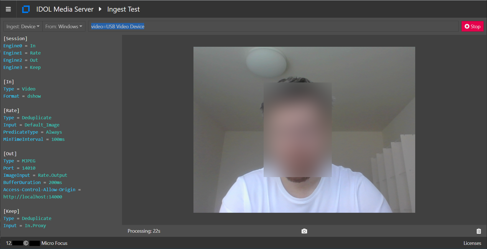

# Setup connection to your webcam

This is a setup guide for ingestion of webcam video into Media Server.  If you do not have a webcam, go to [Plan B](#plan-b).

<!-- TOC depthFrom:2 -->

- [Connecting to your webcam](#connecting-to-your-webcam)
  - [Configuration change for Linux](#configuration-change-for-linux)
  - [Connectivity problems](#connectivity-problems)
    - [Plan B](#plan-b)

<!-- /TOC -->

## Connecting to your webcam

Open the Media Server user interface [`\a=gui`](http://localhost:14000/a=gui#/ingest) (tested in Google Chrome) then follow these steps to connect to your webcam:

1. Set Ingest type to "Device"
1. Set operating system family to "Linux" or "Windows" as appropriate
1. Enter the device connection string:

    > To find your webcam connection name please follow these steps:
    > 
    > On Windows:
    > 
    > 1. Install `ffmpeg`, then from the command line, list the available devices:
    > 
    >     ```bsh
    >     $ ffmpeg -list_devices true -f dshow -i dummy
    >       ...
    >     [dshow @ 000001747bbb93c0] DirectShow video devices (some may be both video and audio devices)
    >     [dshow @ 000001747bbb93c0]  "USB Video Device"
    >     [dshow @ 000001747bbb93c0]     Alternative name "@device_pnp_\\?\usb#vid_04f2&pid_b5ee&mi_00#6&244de3b&0&   > 0000#{65e8773d-8f56-11d0-a3b9-00a0c9223196}\global" 
    >     [dshow @ 000001747bbb93c0] DirectShow audio devices
    >     [dshow @ 000001747bbb93c0]  "Microphone (Conexant ISST Audio)"
    >     [dshow @ 000001747bbb93c0]     Alternative name "@device_cm_{33D9A762-90C8-11D0-BD43-00A0C911CE86}\wave_>     {7FD05CD2-493B-49AA-BFE2-C091EB64D594}"
    >     ```
    > 
    > 1. paste `video=USB Video Device` into the ingest test web page.
    > 
    > On Ubuntu:
    > 
    > 1. Install `v4l-utils`, then use the control tool to list available devices:
    > 
    >     ```bsh
    >     $ apt-get install v4l-utils
    >     $ v4l2-ctl --list-devices
    > 
    >     HP HD Camera (usb-0000:00:1d.0-1.4):
    >             /dev/video0
    >     ```
    > 
    > 1. paste `video=/dev/video0` into the ingest test web page.


  1. Click the blue `Process` button.  After a short time, your webcam stream should begin to play in your browser.  

      
  
      > Media Server is encoding your live webcam video to an MJPEG stream, which your browser natively knows how to play.  The configuration to do this is listed on the left panel of the ingest test page.  This configuration will be more comprehensible for you once you have completed the introductory tutorials.


To stop testing, click the red `Stop` button.

### Configuration change for Linux

There is one configuration difference between ingesting webcam video on Linux compared to on Windows that you will need to keep in mind when following webcam-based tutorial examples later on.  Look at the ingest engine section in the screenshot above as an example.  To switch this from Windows to Linux, you would need to make the following edit:

```diff
[VideoIngest]
Type = Video
- Format = dshow
+ Format = v4l2
```

This change is marked in all webcam-targeted configuration examples, so you will only need to toggle comments on the relevant lines.

### Connectivity problems

If the video is not displayed, or you receive an error message, double check that you have set the correct camera name in the test page.

If it's still not working try reinstalling your webcam drivers or, if all that fails, go to Plan B.

#### Plan B

If do not have a webcam or cannot connect to your webcam, you can simply process a video file instead.

There are some configuration differences between ingesting video from webcam and a file that you will need to keep in mind when following webcam-based tutorial examples later on.  Let's look at a snippet from `introduction/faceAnalysis1.cfg` as an example:

```diff
[Session]
Engine0 = VideoIngest
+ IngestRate = 0
...

[VideoIngest]
Type = Video
- Format = dshow
```

These changes are marked in all webcam-targeted configuration examples, so you will only need to toggle comments on the relevant lines.
