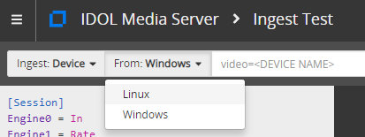
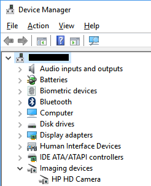
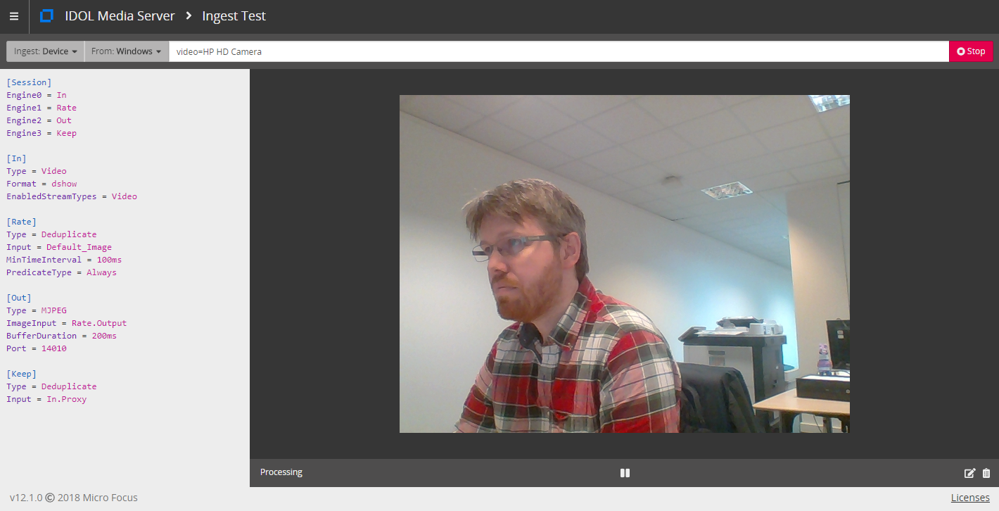

# Setup connection to your webcam

This is a setup guide for ingestion of webcam video into Media Server.  If you do not have a webcam, go to [Plan B](#plan-b).

<!-- TOC depthFrom:2 -->

- [Connecting to your webcam](#connecting-to-your-webcam)
  - [Windows](#windows)
  - [Ubuntu](#ubuntu)
    - [Configuration change for Linux](#configuration-change-for-linux)
- [Verify your connection](#verify-your-connection)
  - [Connectivity problems](#connectivity-problems)
    - [Plan B](#plan-b)

<!-- /TOC -->

## Connecting to your webcam

Open the Media Server user interface [`gui`](http://localhost:14000/a=gui#/ingest) (tested in Google Chrome) then follow these steps to test connectivity to your webcam:

1. Set Ingest type to "Device"
1. Set operating system family to "Linux" or "Windows" as appropriate
1. Enter the device connection string (see below for how to find it)

    

To find your webcam connection name please follow these steps:

### Windows

There are two methods to find this information on Windows:

<details><summary>With the Device Manager application.</summary>

1. open Device Manager
1. under "Imaging devices", see your device name, *e.g.* "HP HD Camera".

   

1. paste the string `video=HP HD Camera` into the ingest test web page.

</details>

<details><summary>From the command line with ffmpeg.</summary>

1. List the available devices:

    ```bsh
    $ ffmpeg -list_devices true -f dshow -i dummy
    ffmpeg version ... Copyright (c) 2000-2016 the FFmpeg developers
      ...
    [dshow @ 000000000050a400] DirectShow video devices (some may be both video and audio devices)
    [dshow @ 000000000050a400]  "HP HD Webcam [Fixed]"
    [dshow @ 000000000050a400]     Alternative name ...
    [dshow @ 000000000050a400] DirectShow audio devices
    [dshow @ 000000000050a400]  "Internal Microphone Array (IDT "
    [dshow @ 000000000050a400]     Alternative name ...
    [dshow @ 000000000050a400]  "Stereo Mix (IDT High Definition"
    [dshow @ 000000000050a400]     Alternative name ...
    ```

1. paste the name `HP HD Webcam [Fixed]` into the ingest test web page.

</details>

### Ubuntu

1. install `v4l-utils`, then use the control tool to list available devices:

    ```bsh
    $ apt-get install v4l-utils
    $ v4l2-ctl --list-devices

    HP HD Camera (usb-0000:00:1d.0-1.4):
            /dev/video0
    ```

1. paste the name `/dev/video0` into the ingest test web page.

#### Configuration change for Linux

There is one configuration difference between ingesting webcam video on Linux compared to on Windows that you will need to keep in mind when following webcam-based tutorial examples later on.  Let's look at a snippet from `introduction/faceAnalysis1.cfg` as an example:

```diff
[VideoIngest]
Type = Video
- Format = dshow
+ Format = v4l2
```

This change is marked in all webcam-targeted configuration examples, so you will only need to toggle comments on the relevant lines.

## Verify your connection

Back on the ingest test page, click `Process`.  After a short time, and if all is well, your webcam stream will begin to play in your browser.  Media Server is re-streaming your webcam video to MJPEG, which your browser natively knows how to play.  The configuration to do this is listed on the left panel of the ingest test page.  This configuration will be more easily readable for you once you have completed the introductory tutorials.  To stop testing, click `Stop`.



### Connectivity problems

If the video is not displayed, or you receive an error message, double check that you have set the correct camera name in the test page.

If it's still not working try reinstalling your webcam drivers or, if all that fails, go to Plan B.

#### Plan B

If do not have a webcam or cannot connect to your webcam, you can simply process a video file instead.

There are some configuration differences between ingesting video from webcam and a file that you will need to keep in mind when following webcam-based tutorial examples later on.  Let's look at a snippet from `introduction/faceAnalysis1.cfg` as an example:

```diff
[Session]
Engine0 = VideoIngest
+ IngestRate = 0
...

[VideoIngest]
Type = Video
- Format = dshow
```

These changes are marked in all webcam-targeted configuration examples, so you will only need to toggle comments on the relevant lines.
