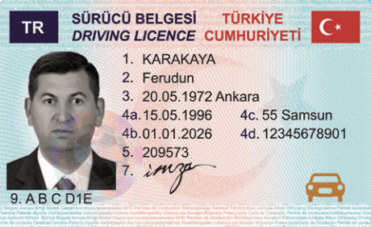
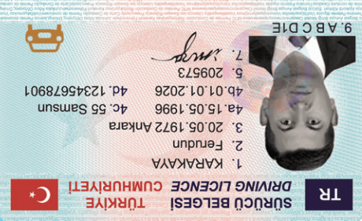
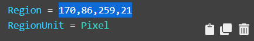
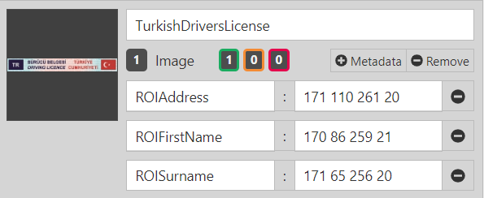
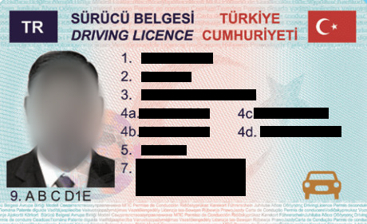

# ID Card Processing

Media Server includes an Optical Character Recognition (OCR) analysis engine, which can be configured to read specific scripts in images and video, such as Japanese characters or Arabic numerals.

For a detailed introduction to Optical Character Recognition, see the [admin guide](https://www.microfocus.com/documentation/idol/IDOL_12_5/MediaServer_12.5_Documentation/Guides/html/English/index.html#Operations/Analyze/OCR_overview.htm).

We will:

1. use the OCR analysis engine to read the text from an image of an ID card
    
1. use Face Detection to identify rotated images along with a transform engine to correct them
1. recognize a type of document in order to define OCR regions to maintain document structure
1. encode a redacted image to hide sensitive data

This guide assumes you have already completed the [introductory tutorial](../../introduction/README.md).

<!-- TOC depthFrom:2 -->

- [Setup](#setup)
  - [Configure the required analytics](#configure-the-required-analytics)
    - [Enabled modules](#enabled-modules)
    - [Licensed channels](#licensed-channels)
- [Process configuration to read text](#process-configuration-to-read-text)
  - [Image file ingest](#image-file-ingest)
  - [Analysis](#analysis)
  - [Output](#output)
  - [Running our analysis](#running-our-analysis)
- [Correct rotated scans](#correct-rotated-scans)
  - [Analysis](#analysis-1)
  - [Transform](#transform)
  - [Cropping each card](#cropping-each-card)
  - [Running our analysis](#running-our-analysis-1)
- [Templated OCR](#templated-ocr)
  - [Train an anchor image](#train-an-anchor-image)
  - [Define the OCR regions](#define-the-ocr-regions)
  - [Add the OCR regions](#add-the-ocr-regions)
  - [Analysis](#analysis-2)
  - [Transform](#transform-1)
  - [Running our analysis](#running-our-analysis-2)
- [Redact personal information](#redact-personal-information)
  - [Event Processing](#event-processing)
  - [Transform](#transform-2)
  - [Running our analysis](#running-our-analysis-3)
- [Next steps](#next-steps)

<!-- /TOC -->

## Setup

### Configure the required analytics

Media Server must be licensed for visual analytics, as described in the [introductory tutorial](../../introduction/PART_I.md#enabling-analytics).  To reconfigure Media Server you must edit your `mediaserver.cfg` file.

#### Enabled modules

The `Modules` section is where we list the engines that will be available to Media Server on startup.  Ensure that this list contains the module `objectrecognition`:

```ini
[Modules]
Enable=...,facedetect,objectrecognition,ocr,...
```

#### Licensed channels

*Reminder*: The `Channels` section is where we instruct Media Server to request license seats from License Server.  Media Server has four license *flavours*:

1. Audio
1. Surveillance
1. Visual
1. Video Management

To enable object recognition for this tutorial, you need to enable at least one channel of type *Visual*:

```ini
[Channels]
...
VisualChannels=1
```

> For any changes you make in `mediaserver.cfg` to take effect you must restart Media Server.

## Process configuration to read text

### Image file ingest

To ingest an image file couldn't be simpler.  We will include the following in our process configuration:

```ini
[Session]
Engine0 = Source

[Source]
Type = image
```

For full details on the options available for ingesting image sources, please read the [reference guide](https://www.microfocus.com/documentation/idol/IDOL_12_5/MediaServer_12.5_Documentation/Help/index.html#Configuration/Ingest/Image/_Image.htm).

### Analysis

To read text, we need to include the following minimal configuration:

```ini
[OCR]
Type = ocr
Languages = en,tr
WordRejectThreshold = 75
```

We have specified two parameters that affect how the analytic runs, namely the languages to search for and a confidence threshold.  For full details on these and other available options, please read the [reference guide](https://www.microfocus.com/documentation/idol/IDOL_12_5/MediaServer_12.5_Documentation/Help/index.html#Configuration/Analysis/OCR/_OCR.htm).

### Output

For this first step we will simply output all the words we have read in a single plain-text file:

```ini
[WriteText]
Type = xml
Input = OCR.Result
XMLOutputPath = output/idCard1/%source.filename%.txt
XSLTemplate = toText.xsl
```

As in the introductory tutorials, we are using an XSL transform to extract the words from the standard XML output.  In this case, using an out-of-the-box transform included with Media Server.  See [tips on XSL transforms](../../appendix/XSL_tips.md) for more information. 

### Running our analysis

Let's try it. Run [`action=process`](http://localhost:14000/a=process&source=C:\MicroFocus\IDOLServer-12.5.0\sample_media\Turkey1.png&configName=tutorials/idCard1.cfg).

Go to Media Server's `output/idCard1` directory to see the results.

## Correct rotated scans

Imagine this document was scanned and the person who did it put the card in upside down or rotated to one side.  We would like to handle these documents automatically.  For documents containing faces, we can make use of engine chaining and Face Detection in order to find the true orientation and correct it before running OCR as before.



### Analysis

To detect faces in any orientation, we need to include the following analysis configuration:

```ini
[FaceDetect]
Type = FaceDetect
Orientation = Any
```

We have specified that faces should be looked for in any orientation.  For full details on these and other available options, please read the [reference guide](https://www.microfocus.com/documentation/idol/IDOL_12_5/MediaServer_12.5_Documentation/Help/index.html#Configuration/Analysis/Face/_Face.htm).

### Transform

To rotate the image based on the orientation of the detected face, we need to include the following transform configuration:

```ini
[RotateFace]
Type = Rotate
Input = FaceDetect.ResultWithSource
LuaScript = inverseFaceAngle.lua
```

We are invoking an out-of-the-box Lua script to capture the angle of rotation of the detected face:

```lua
-- returns the angle required to rotate a face upright (in degrees)
function getAngle(record)
	return -record.FaceData.ellipse.angle
end
```

For full details on this and other available transformations, please read the [reference guide](https://www.microfocus.com/documentation/idol/IDOL_12_5/MediaServer_12.5_Documentation/Help/index.html#Configuration/Transform/_Transform.htm).

### Cropping each card

After using the face detections to apply a rotation for each scanned card, we can also use this information to estimate a bounding rectangle for each card.  To achieve this we will use the *SetRectangle* and *Crop* engines to define an area around the face and encode an image from it:

```ini
[IdCardRectangle]
# Estimate the ID card boundary from the detected face region.
Type = SetRectangle
Input = RotateFace.Output
LuaLine = function rectangle(x) return { left = x.RegionData.left - 1 * x.RegionData.width, top = x.RegionData.top - 1.5 * x.RegionData.height, width = 6 * x.RegionData.width, height = 4 * x.RegionData.height } end

[CropIdCard]
Type = Crop
Input = SetRectangle.Output

[SaveImage]
Type = ImageEncoder
ImageInput = CropIdCard.Output
OutputPath = output/idCard2/%source.filename%_rotated.png
```

For full details on these options, please read the reference guide sections on the [SetRectangle](https://www.microfocus.com/documentation/idol/IDOL_12_5/MediaServer_12.5_Documentation/Help/index.html#Configuration/Transform/SetRectangle/_SetRectangle.htm) and [Crop](https://www.microfocus.com/documentation/idol/IDOL_12_5/MediaServer_12.5_Documentation/Help/index.html#Configuration/Transform/Crop/_Crop.htm) transform engines, as well as the [ImageEncoder](https://www.microfocus.com/documentation/idol/IDOL_12_5/MediaServer_12.5_Documentation/Help/index.html#Configuration/Encoding/ImageEncoder/_ImageEncoder.htm) engine.

### Running our analysis

Run [`action=process`](http://localhost:14000/a=process&source=C:\MicroFocus\IDOLServer-12.5.0\sample_media\Turkey2.png&configName=tutorials/idCard2.cfg).

Go to Media Server's `output/idCard2` directory to see the three resulting cropped ID card images.

## Templated OCR

ID are structured data, *e.g.* showing names, dates etc.  In reading the whole scanned image, as we have done above, we have lost this structure.  In order to get it back we can define a template for OCR.  The template consists of the following information:

1. An anchor, *i.e.* some uniquely identifying feature of the ID card type, such as the top banner 
    
1. A list of regions to be processed with OCR

### Train an anchor image

We can train a template via the API or by using the Media Server [GUI](http://localhost:14000/a=gui), with the following steps:

1. Go to the *Visual Training* page.
1. Select *Object Recognition* from the top right dropdown menu.
1. Create a new Database and name it `IDCardTemplates`.
1. Create a new Identity and name it `TurkishDriversLicense`.
1. Import the image `TurkishDriversLicenseHeader.png` from this tutorial then press the `Build` button.


For full details on training options for Object Recognition, please read the [reference guide](https://www.microfocus.com/documentation/idol/IDOL_12_5/MediaServer_12.5_Documentation/Help/index.html#Actions/Training/TrainObject.htm).

### Define the OCR regions

We can make use of the Media Server [GUI](http://localhost:14000/a=gui) to define these OCR regions:

1. Go to the *Ingest Test* page.
1. Import the image file `Turkey1.png`, then click the `Ingest` button.
1. Click the `draw regions` button:
    
    

1. With your mouse over the image of the ID card, click and drag then release to define your regions.

    > If you don't draw the region right first time, click and drag the corners to edit the shape.

1. Define separate regions for each interesting area fo text to be read, *e.g.*

    

### Add the OCR regions

The final step is to add our OCR region definitions to the trained template as metadata fields.

1. Keeping the *Ingest Test* page open in one browser tab, open another tab with the *Visual Training* page.
1. For each region, copy the text on screen, *e.g.*

    

1. On the *Visual Training* page, click to add Metadata to the ID card identity.
1. Enter a label for this region, which must include the prefix `ROI`.
1. Paste your copied region as the value or this metadata field.

    > You must replace the commas between numbers with spaces.

2. Repeat this process for each field and you will start to build a list of metadata like this:

    
  
> As a short cut, you can add
each OCR region as metadata by clicking each of the following links to call the API: 
> - [`ROIsurname`](http://localhost:14000/action=AddObjectMetadata&database=IDCardTemplates&identifier=TurkishDriversLicense&key=ROIsurname&value=38%2022%2035%209)
> - [`ROIfirstname`](http://localhost:14000/action=AddObjectMetadata&database=IDCardTemplates&identifier=TurkishDriversLicense&key=ROIfirstname&value=38%2030%2035%209)
> - [`ROIdateplaceofbirth`](http://localhost:14000/action=AddObjectMetadata&database=IDCardTemplates&identifier=TurkishDriversLicense&key=ROIdateplaceofbirth&value=38%2038%2035%209)
> - [`ROIissuedate`](http://localhost:14000/action=AddObjectMetadata&database=IDCardTemplates&identifier=TurkishDriversLicense&key=ROIissuedate&value=39%2046%2022%209)
> - [`ROIexpirydate`](http://localhost:14000/action=AddObjectMetadata&database=IDCardTemplates&identifier=TurkishDriversLicense&key=ROIexpirydate&value=38%2054%2022%209)
> - [`ROIcode5`](http://localhost:14000/action=AddObjectMetadata&database=IDCardTemplates&identifier=TurkishDriversLicense&key=ROIcode5&value=38%2062%2022%209)
> - [`ROIaddress`](http://localhost:14000/action=AddObjectMetadata&database=IDCardTemplates&identifier=TurkishDriversLicense&key=ROIaddress&value=70%2046%2025%209)
> - [`ROIcode4d`](http://localhost:14000/action=AddObjectMetadata&database=IDCardTemplates&identifier=TurkishDriversLicense&key=ROIcode4d&value=70%2054%2025%209)
> - [`ROIvehicletypes`](http://localhost:14000/action=AddObjectMetadata&database=IDCardTemplates&identifier=TurkishDriversLicense&key=ROIvehicletypes&value=6%2084%2021%207)
>
> You may need to refresh the GUI to display these new metadata fields.

For full details on the metadata API for Object Recognition, please read the [reference guide](https://www.microfocus.com/documentation/idol/IDOL_12_5/MediaServer_12.5_Documentation/Help/index.html#Actions/Training/AddObjectMetadata.htm).

### Analysis

To identify the document anchor, we need to run Object Recognition using the following event processing configuration:

```ini
[Template]
Type = ObjectRecognition
Database = IDCardTemplates
Geometry = SIM2
```

Here we use the Geometry option `SIM2` to only consider 2-dimensional rotations, since we assume these ID cards are scanned.  For full details on options for Object Recognition, please read the [reference guide](https://www.microfocus.com/documentation/idol/IDOL_12_5/MediaServer_12.5_Documentation/Help/index.html#Configuration/Analysis/Object/_Object.htm).

### Transform

To define regions in which to run OCR for the recognized template, we need to include the following transform configuration:

```ini
[TextRegion]
Type = SetRectangle
LuaScript = getAssociatedRectanglesDemo.lua
Input = Template.ResultWithSource
```

We are invoking a custom Lua script `getAssociatedRectanglesDemo.lua`.  Now, copy this file into Media Server's `configurations\lua` folder.

### Running our analysis

Run [`action=process`](http://localhost:14000/a=process&source=C:\MicroFocus\IDOLServer-12.5.0\sample_media\Turkey1.png&configName=tutorials/idCard3.cfg).

Go to Media Server's `output/idCard3` directory to see the results.

## Redact personal information

This document contains personal information.  You might want to create a redacted version of the original image in order to share it in a report.  We can make use of the Blur transform engine to do this automatically for us.

### Event Processing

To redact all the sensitive regions, we need to combine detection information for any faces and words together using the following event processing configuration:

```ini
[ImageWithRegions]
Type = Combine
Input0 = FaceDetect.ResultWithSource
Input1 = OCR.Result
```

For full details on this and other available event processing methods, please read the [reference guide](https://www.microfocus.com/documentation/idol/IDOL_12_5/MediaServer_12.5_Documentation/Help/index.html#Configuration/ESP/ESP.htm).

### Transform

To blur those sensitive regions, we need to include the following transform configuration:

```ini
[BlurAll]
Type = Blur
Input = ImageWithRegions.Output
```

### Running our analysis

Run [`action=process`](http://localhost:14000/a=process&source=C:\MicroFocus\IDOLServer-12.5.0\sample_media\Turkey1.png&configName=tutorials/idCard4.cfg).

Go to Media Server's `output/idCard4` directory to see the results.



## Next steps

Why not try more tutorials to explore some of the other analytics available in Media Server, linked from the [main page](../../README.md).
