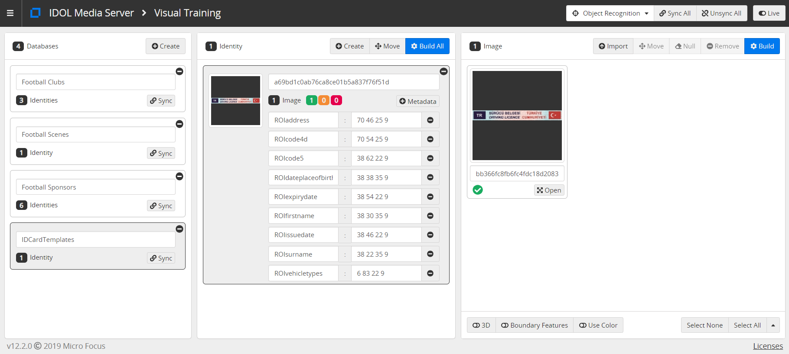
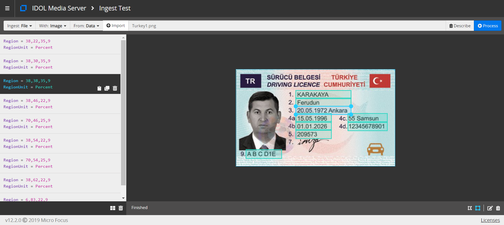

# ID Card Processing

Media Server includes an Optical Character Recognition (OCR) analysis engine, which can be configured to read specific scripts in images and video, such as Japanese characters or Arabic numerals.

For a more detailed introduction to Optical Character Recognition, see the [admin guide](https://www.microfocus.com/documentation/idol/IDOL_12_3/MediaServer_12.3_Documentation/Guides/html/English/index.html#Operations/Analyze/OCR_overview.htm).

We will:

1. use the OCR analysis engine to read the text from an image of an ID card
2. use Face Detection to identify rotated images along with a transform engine to correct them
3. recognize a type of document in order to define OCR regions to maintain document structure
4. encode a redacted image to hide sensitive data

This guide assumes you have already completed the [introductory tutorial](../../introduction/README.md).

<!-- TOC depthFrom:2 -->

- [Setup](#setup)
  - [Configure the required analytics](#configure-the-required-analytics)
    - [Enabled modules](#enabled-modules)
    - [Licensed channels](#licensed-channels)
- [Process configuration to read text](#process-configuration-to-read-text)
  - [Image file ingest](#image-file-ingest)
  - [Analysis](#analysis)
  - [Output](#output)
  - [Running our analysis](#running-our-analysis)
- [Correct rotated scans](#correct-rotated-scans)
  - [Analysis](#analysis-1)
  - [Transform](#transform)
  - [Encoding](#encoding)
  - [Running our analysis](#running-our-analysis-1)
- [Templated OCR](#templated-ocr)
  - [Analysis](#analysis-2)
  - [Transform](#transform-1)
  - [Running our analysis](#running-our-analysis-2)
- [Redact personal information](#redact-personal-information)
  - [Event Processing](#event-processing)
  - [Transform](#transform-2)
  - [Running our analysis](#running-our-analysis-3)
- [Next steps](#next-steps)

<!-- /TOC -->

## Setup

### Configure the required analytics

Media Server must be licensed for visual analytics, as described in the [introductory tutorial](../../introduction/PART_I.md#enabling-analytics).  To reconfigure Media Server you must edit your `mediaserver.cfg` file.

#### Enabled modules

The `Modules` section is where we list the engines that will be available to Media Server on startup.  Ensure that this list contains the module `objectrecognition`:

```ini
[Modules]
Enable=...,facedetect,objectrecognition,ocr,...
```

#### Licensed channels

*Reminder*: The `Channels` section is where we instruct Media Server to request license seats from License Server.  Media Server has four license *flavours*:

1. Audio
1. Surveillance
1. Visual
1. Video Management

To enable object recognition for this tutorial, you need to enable at least one channel of type *Visual*:

```ini
[Channels]
...
VisualChannels=1
```

*N.B.* For any changes you make in `mediaserver.cfg` to take effect you must restart Media Server.

## Process configuration to read text

### Image file ingest

To ingest an image file couldn't be simpler.  We will include the following in our process configuration:

```ini
[Session]
Engine0 = Source

[Source]
Type = image
```

For full details on the options available for ingesting image sources, please read the [reference guide](https://www.microfocus.com/documentation/idol/IDOL_12_3/MediaServer_12.3_Documentation/Help/index.html#Configuration/Ingest/Image/_Image.htm).

### Analysis

To read text, we need to include the following minimal configuration:

```ini
[OCR]
Type = ocr
Languages = en,tr
WordRejectThreshold = 75
```

We have specified two parameters that affect how the analytic: the lanagues to search for and a confidence threshold.  For full details on these and other available options, please read the [reference guide](https://www.microfocus.com/documentation/idol/IDOL_12_3/MediaServer_12.3_Documentation/Help/index.html#Configuration/Analysis/OCR/_OCR.htm).

### Output

For this first step we will simply output all the words we have read in a single plain-text file:

```ini
[WriteText]
Type = xml
Input = OCR.Result
XMLOutputPath = output/idCard1/%source.filename%.txt
XSLTemplate = toText.xsl
```

As in the introductory tutorials, we are using an XSL transform to extact the words from the internal structured information.  In this case, using an out-of-the-box transfor included with Media Server.

### Running our analysis

Let's try it. Run [`action=process`](http://localhost:14000/a=process&source=C:\MicroFocus\IDOLServer-12.3.0\sample_media\Turkey1.png&configName=tutorials/idCard1.cfg).

Go to Media Server's `output/idCard1` directory to see the results.

## Correct rotated scans

Imagine this document was scanned upside down.  We would like to handle these documents automatically.  For documents containing faces, we can make use of engine chaining and Face Detection in order to find the true orientation and correct it before running OCR as before.

### Analysis

To detect faces in any orientation, we need to include the following analysis configuration:

```ini
[FaceDetect]
Type = FaceDetect
Orientation = Any
```

We have specified that faces should be looked for in any orientation.  For full details on these and other available options, please read the [reference guide](https://www.microfocus.com/documentation/idol/IDOL_12_3/MediaServer_12.3_Documentation/Help/index.html#Configuration/Analysis/Face/_Face.htm).

### Transform

To rotate the image based on the orientation of the detected face, we need to include the following transform configuration:

```ini
[RotateFace]
Type = Rotate
Input = FaceDetect.ResultWithSource
LuaScript = inverseFaceAngle.lua
```

We are envoking an out-of-the-box Lua script to capture the angle of rotation of the detected face:

```lua
-- returns the angle required to rotate a face upright (in degrees)
function getAngle(record)
	return -record.FaceData.ellipse.angle
end
```

For full details on this and other available transformations, please read the [reference guide](https://www.microfocus.com/documentation/idol/IDOL_12_3/MediaServer_12.3_Documentation/Help/index.html#Configuration/Transform/_Transform.htm).

### Encoding

To demonstrate this rotation, we will also encode an image:

```ini
[SaveImage]
Type = imageencoder
ImageInput = RotateFace.Output
OutputPath = output/idCard2/%source.filename%_rotated.png
```

For full details on image encoding options, please read the [reference guide](https://www.microfocus.com/documentation/idol/IDOL_12_3/MediaServer_12.3_Documentation/Help/index.html#Configuration/Encoding/ImageEncoder/_ImageEncoder.htm).

### Running our analysis

Run [`action=process`](http://localhost:14000/a=process&source=C:\MicroFocus\IDOLServer-12.3.0\sample_media\Turkey2.png&configName=tutorials/idCard2.cfg).

Go to Media Server's `output/idCard2` directory to see the results.

## Templated OCR

ID are structured data, *e.g.* showing names, dates etc.  In reading the whole scanned image, as we have done above, we have lost this structure.  In order to get it back we need to define a template for OCR.  The template consist of the following information:

1. An anchor, *i.e.* some uniquely identifying feature of the ID card type, such as the top banner 
2. A list of regions to be processed with OCR

We can train a template with the following actions:

- Create a database (container for templates): [`action=CreateObjectDatabase`](http://localhost:14000/a=CreateObjectDatabase&database=IDCardTemplates)
- Train a template: [`action=TrainObject`](http://localhost:14000/a=TrainObject&database=IDCardTemplates&imagepath=C:\MicroFocus\IDOLServer-12.3.0\sample_media\TurkishDriversLicenseHeader.png&metadata=ROIsurname:38 22 35 9,ROIfirstname:38 30 35 9,ROIdateplaceofbirth:38 38 35 9,ROIissuedate:39 46 22 9,ROIexpirydate:38 54 22 9,ROIcode5:38 62 22 9,ROIaddress:70 46 25 9,ROIcode4d:70 54 25 9,ROIvehicletypes:6 84 21 7)

You can see the trained template using the Media Server [GUI](http://localhost:14000/a=gui):



For full details on training options for Object Recognition, please read the [reference guide](https://www.microfocus.com/documentation/idol/IDOL_12_3/MediaServer_12.3_Documentation/Help/index.html#Actions/Training/TrainObject.htm).

These regions were defined using the Media Server [GUI](http://localhost:14000/a=gui#/ingest):



### Analysis

To identify the document anchor, we need to run Object Recognition using the following event processing configuration:

```ini
[Template]
Type = objectrecognition
Database = IDCardTemplates
Geometry = SIM2
```

For full details on options for Object Recognition, please read the [reference guide](https://www.microfocus.com/documentation/idol/IDOL_12_3/MediaServer_12.3_Documentation/Help/index.html#Configuration/Analysis/Object/_Object.htm).

### Transform

To define regions in which to run OCR for the recognized template, we need to include the following transform configuration:

```ini
[TextRegion]
Type = setrectangle
LuaScript = getAssociatedRectanglesDemo.lua
Input = Template.ResultWithSource
```

We are envoking a custom Lua script `getAssociatedRectanglesDemo.lua`.  Now, copy this file into Media Server's `configurations\lua` folder.

### Running our analysis

Run [`action=process`](http://localhost:14000/a=process&source=C:\MicroFocus\IDOLServer-12.3.0\sample_media\Turkey1.png&configName=tutorials/idCard3.cfg).

Go to Media Server's `output/idCard3` directory to see the results.

## Redact personal information

This document contains personal information.  You might want to create a redacted version of the original image in order to share it in a report.  We can make use of the Blur transform engineto do this automatically for us.

### Event Processing

To redact all the sensitive regions, we need to combine detection information for any faces and words together using the following event processing configuration:

```ini
[ImageWithRegions]
Type = Combine
Input0 = FaceDetect.ResultWithSource
Input1 = OCR.Result
```

For full details on this and other available event processing methods, please read the [reference guide](https://www.microfocus.com/documentation/idol/IDOL_12_3/MediaServer_12.3_Documentation/Help/index.html#Configuration/ESP/ESP.htm).

### Transform

To blur those sensitive regions, we need to include the following transform configuration:

```ini
[BlurAll]
Type = Blur
Input = ImageWithRegions.Output
```

### Running our analysis

Run [`action=process`](http://localhost:14000/a=process&source=C:\MicroFocus\IDOLServer-12.3.0\sample_media\Turkey1.png&configName=tutorials/idCard4.cfg).

Go to Media Server's `output/idCard4` directory to see the results.

## Next steps

Why not try more tutorials to explore some of the other analytics available in Media Server, linked from the [main page](../../README.md).
