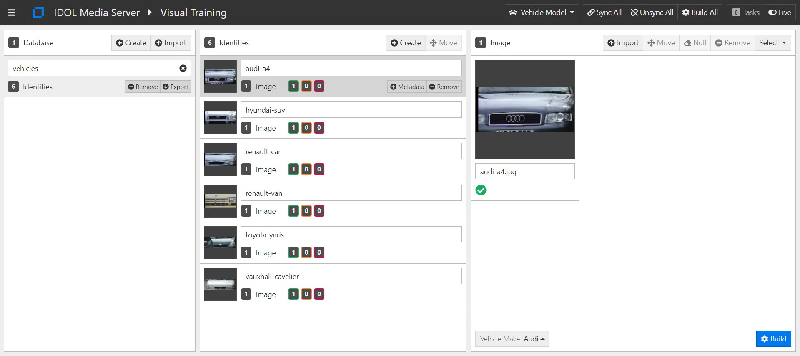

# Vehicle analysis

Media Server includes a *NumberPlate* analysis engine, which can be configured to read number (license) plates from over 100 countries and states around the world.  With analysis chaining, the vehicle make, model and color can also be determined.

We will:

1. use the *NumberPlate* analysis engine to read Saudi number plates in a video from a moving vehicle
1. identify vehicle make and model
1. identify vehicle color

This guide assumes you have already completed the [introductory tutorial](../../README.md#introduction).

<!-- TOC -->

- [Vehicle analysis](#vehicle-analysis)
  - [Setup](#setup)
    - [Configure vehicle analysis](#configure-vehicle-analysis)
      - [Enabled modules](#enabled-modules)
      - [Licensed channels](#licensed-channels)
  - [Process configuration](#process-configuration)
  - [Making changes](#making-changes)
  - [Training vehicle analysis](#training-vehicle-analysis)
    - [Vehicle makes](#vehicle-makes)
    - [Training vehicle models (*Optional*)](#training-vehicle-models-optional)
  - [Processing video](#processing-video)
  - [Next steps](#next-steps)

<!-- /TOC -->

## Setup

### Configure vehicle analysis

Media Server must be licensed for visual analytics, as described in the [introductory tutorial](../../introduction/PART_I.md#enabling-analytics).  To reconfigure Media Server you must edit your `mediaserver.cfg` file.

#### Enabled modules

The `Modules` section is where we list the engines that will be available to Media Server on startup.  Ensure that this list contains the modules `numberplate` and `vehiclemodel`:

```ini
[Modules]
Enable=...,numberplate,...,vehiclemodel
```

#### Licensed channels

*Reminder*: The `Channels` section is where we instruct Media Server to request license seats from License Server.  Media Server has four license *flavours*:

1. Audio
1. Surveillance
1. Visual
1. Video Management

To enable object recognition for this tutorial, you need to enable at least one channel of either *Surveillance* or *Visual*:

```ini
[Channels]
...
VisualChannels=1
```

*N.B.* For any changes you make in `mediaserver.cfg` to take effect you must restart Media Server.

## Process configuration

Media Server ships with a number of sample configurations, including some for number plate and vehicle analysis.  We will use the example `configurations/examples/VehicleModel/WithColor.cfg`, which configures the required analysis engines, as well as engines to output XML alerts and to encode images of the detected number plates.

This includes the minimal configuration for number plate recognition, which requires only that you set a location, *i.e.* GB for the United Kingdom.

```ini
[Anpr]
Type = numberplate
Location = GB
```

You can also set multiple locations here, with or without weightings to indicate the relative likelihood of seeing a plate form that location:

```ini
Location=FR,DE,BE
```

or

```ini
LocationWithPriorities=FR:1.0,DE:0.1,BE:0.01
```

This minimal configuration uses the following default options, which can be read about in detail in the [reference guide](https://www.microfocus.com/documentation/idol/IDOL_12_5/MediaServer_12.5_Documentation/Help/index.html#Configuration/Analysis/ANPR/_NumberPlate.htm) and are shown here grouped by their functions.

```ini
# Detection of plates
Boldness = 17
ExpectedRotation = 0.0 # degrees (clockwise) from horizontal
MaxCharHeight = 96 # pixels
MaxPlatesPerFrame = 3
MinCharheight = 12 # pixels
Sensitivity = 10

# Processing
NumParallel = 1
SampleInterval = 1ms

# Integration
MinRead = 2

# Output
MinValidScore = 92
OutputAlternativeResults = False
OutputUnformattedResults = False
RejectReadsWithInvalidGaps = True
```

In addition to these parameters it is also possible to set a region of interest in which the analysis will work.  This can be a simple rectangle, specified by `Region` or any polygon, specified by `FreeFormRegion`.

Once a number plate has been detected, we can usually safely assume a vehicle has also been found.  With Media Server's analysis chaining, we can use this location to feed additional analytic engines:

- The *VehicleRecognition* analysis engine, which:
  - recognizes one of the pre-trained vehicle makes, *i.e.* "Tesla"
  - can optionally be trained to match against specific vehicle models, *i.e.* "Model S"

  ```ini
  [VehicleMakeModel]
  Type = vehiclemodel
  Input = Anpr.DataWithSource
  Database=vehicles
  ```

- The *ColorCluster* analysis engine can be used here (similarly to how we used it analyse clothing in the [introductory tutorial](../../introduction/PART_II.md#run-face-and-clothing-analysis)) to:
  - identify the main colors in a patch above the plate
  - to match the main detected colors to a dictionary of predefined colors

  ```ini
  [ColorAnalysis]
  Type = colorcluster
  Input = VehicleMakeModel.ColorRegionWithSource
  ColorDictionary=carcolors.dat
  RestrictToInputRegion=true
  ```

## Making changes

Let's create our own copy to work on `configurations/examples/VehicleModel/WithColor2.cfg` and make the following changes:

1. Reduce the input data rate for vehicle analysis by changing its input from the *data* to the *result* track of the number plate engine:

  ```ini
  [VehicleMakeModel]
  Type = vehiclemodel
  Input = Anpr.ResultWithSource
  ```

1. Attach some additional tracks to a dummy engine so that they will be *in use* and therefore visible in the Activity page:

  ```ini
  [Session]
  ...
  Engine8 = AnprFrameOutput
  Engine9 = Keep

  ...

  [Keep]
  Type = Combine
  Input0 = VehicleMakeModel.DataWithSource
  Input1 = VehicleMakeModel.ResultWithSource
  Input2 = VehicleMakeModel.VehicleMakeImage
  Input3 = Anpr.Start
  Input4 = Anpr.DataWithSource
  Input5 = Anpr.End
  Input6 = ColorAnalysis.ClusteredImage
  ```

1. Finally, since we are ingesting a video file, we should remember to set the `IngestRate` parameter so that we process all frames repeatably:

  ```ini
  [Session]
  ...
  Engine9 = Keep
  IngestRate = 0
  ```

## Training vehicle analysis

### Vehicle makes

Vehicle make identification is pre-trained.  To view the current list of supported vehicle makes, run [`action=listVehicleMakes`](http://127.0.0.1:14000/a=listVehicleMakes).

### Training vehicle models (*Optional*)

Open the training web app at [`/action=gui`](http://127.0.0.1:14000/a=gui#/train/vehicleModel(tool:select)) then follow these steps to train your identity:

1. in the left column, click `Add` to create a new *database* (a collection of identities)
    - rename the database as `vehicles`
1. in the center column, click `Add` to add a new *identity* for each vehicle image in the `vehicles` directory of this guide
    - give your identity a name
    - (*optionally*) add arbitrary key-value metadata
1. on the right, click `+` to import images
    - Navigate to the `vehicles` directory to select the vehicle image provided
    - select the appropriate vehicle make from the drop-up list below your image thumbnail(s).  If your make is not listed, select *Unknown*
1. on the top right menu bar, click `Build` to train each vehicle model



> Cameras that are positioned directly above the traffic are better suited for recognition because they capture images where the vehicles approach head-on.  For further recommendations about image quality, read the [admin guide](https://www.microfocus.com/documentation/idol/IDOL_12_5/MediaServer_12.5_Documentation/Guides/html/English/index.html#Operations/Analyze/Vehicles_Introduction.htm).

## Processing video

Download the sample video [`vehicles.mp4`](http://tech-demo.idol.swinfra.net/tutorial/vehicles.mp4) and save it under `C:\MicroFocus\video`.

> Use `Save As` to avoid opening the video in your browser.
    
Paste the following parameters into [`test-action`](http://127.0.0.1:14000/a=admin#page/console/test-action), remembering to update the `source` parameter to match your setup:

```url
action=process&source=C:/MicroFocus/video/vehicles.mp4&configName=examples/VehicleModel/WithColor2
```

Click `Test Action` to start processing.

Review the results with [`/action=activity`](http://127.0.0.1:14000/a=activity), then go to `output` to see the saved image files and XML.  These will be written in a sub-directory named after the uuid of the session, so look for the newest folder.

Wait for the video to finish processing, or stop early with [`stop`](http://127.0.0.1:14000/a=queueInfo&queueAction=stop&queueName=process).

## Next steps

Why not try more tutorials to explore some of the other analytics available in Media Server, linked from the [main page](../../README.md).
